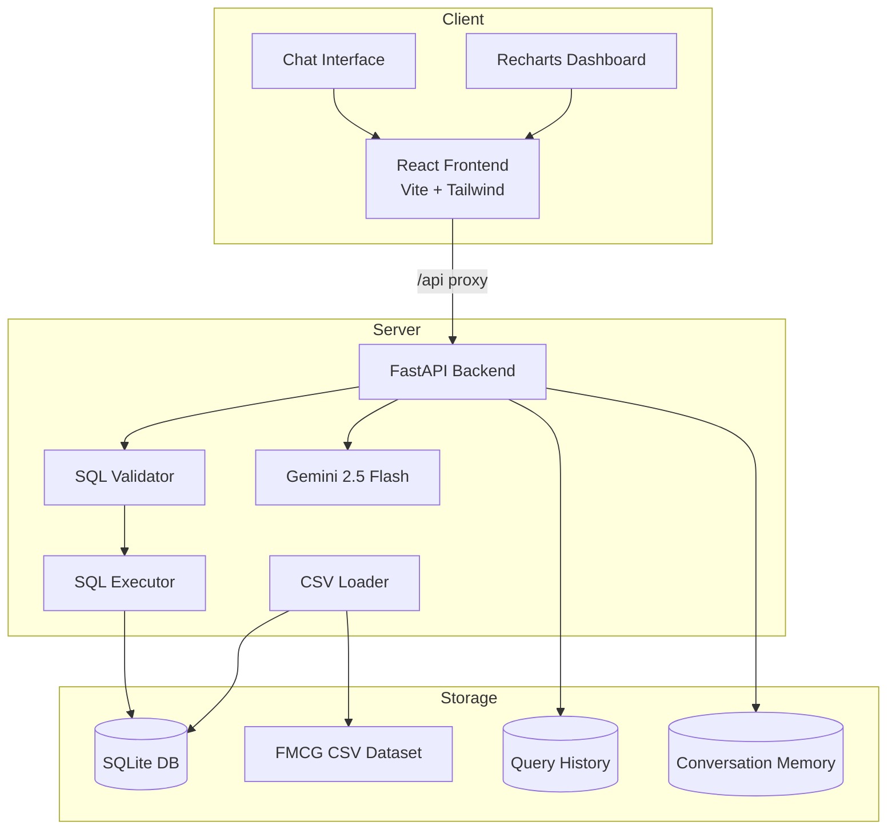
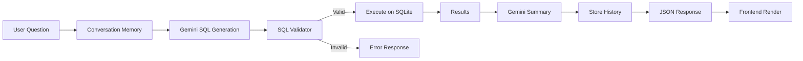
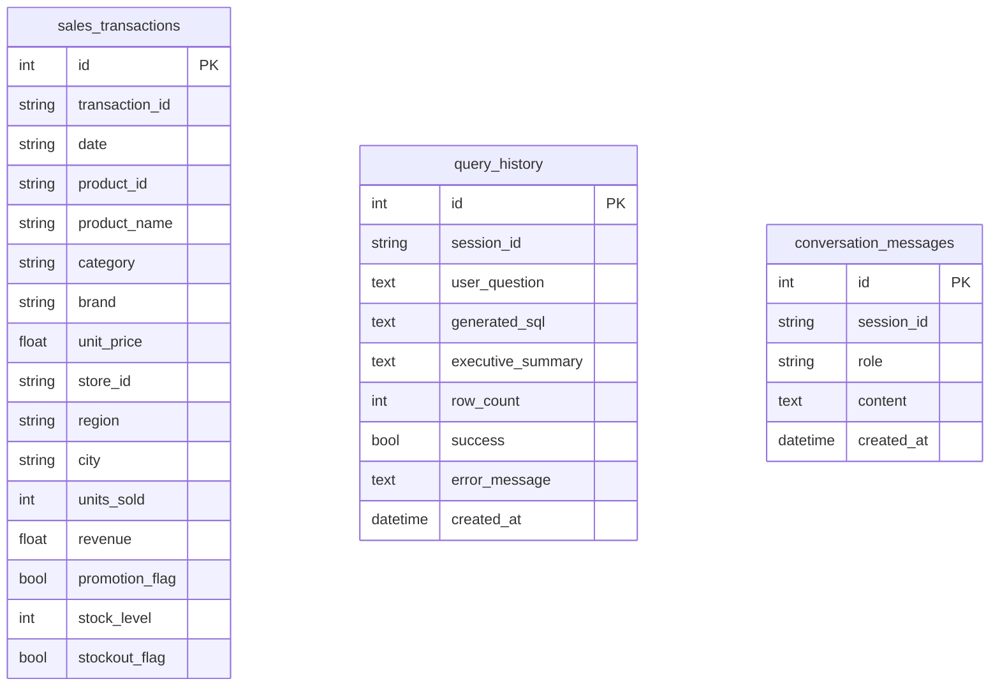

# Architecture

## System Overview

The FMCG Conversational Analytics Platform is a full-stack application that enables business users to query sales data using natural language.

## Component Responsibilities

### Frontend (React + Vite)

| Component | Responsibility |
|-----------|----------------|
| `ChatWindow` | User input, message display, suggestions |
| `Sidebar` | Query history, new conversation |
| `SQLViewer` | Display generated SQL with copy |
| `ResultsTable` | Tabular query results |
| `DashboardCharts` | Auto-generated bar/line/pie charts |
| `ExecutiveSummary` | AI-generated business insights |
| `LoadingSpinner` | Loading states |

### Backend (FastAPI)

| Module | Responsibility |
|--------|----------------|
| `main.py` | REST endpoints, request orchestration |
| `llm.py` | Gemini SQL generation & summaries |
| `validator.py` | SELECT-only SQL enforcement |
| `sql_generator.py` | NL→SQL pipeline & execution |
| `csv_loader.py` | Auto-load CSV on startup |
| `models.py` | Sales, history, conversation ORM |

## Data Flow

## Security

- **SQL Injection Prevention**: Only SELECT/WITH queries allowed
- **Blocked Keywords**: DROP, DELETE, UPDATE, INSERT, ALTER, TRUNCATE, CREATE, etc.
- **Single Statement**: Semicolons in query body rejected
- **API Key**: Gemini key stored in environment variables only

## Database Schema

