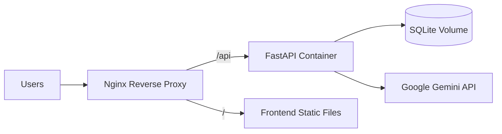

# Deployment Guide

## Local Development

```bash
# Backend
cd backend && pip install -r requirements.txt
uvicorn main:app --reload --port 8000

# Frontend
cd frontend && npm install
npm run dev
```

## Production Build

### Backend

```bash
cd backend
pip install -r requirements.txt
uvicorn main:app --host 0.0.0.0 --port 8000 --workers 2
```

### Frontend

```bash
cd frontend
npm install
npm run build
```

Serve `frontend/dist/` with Nginx or any static file server.

## Docker Deployment



### Example Dockerfile (Backend)

```dockerfile
FROM python:3.11-slim
WORKDIR /app
COPY backend/requirements.txt .
RUN pip install --no-cache-dir -r requirements.txt
COPY backend/ .
COPY data/ /data/
ENV CSV_PATH=/data/fmcg_conversational_ai_dataset.csv
EXPOSE 8000
CMD ["uvicorn", "main:app", "--host", "0.0.0.0", "--port", "8000"]
```

### Example Dockerfile (Frontend)

```dockerfile
FROM node:20-alpine AS build
WORKDIR /app
COPY frontend/package*.json ./
RUN npm ci
COPY frontend/ .
RUN npm run build

FROM nginx:alpine
COPY --from=build /app/dist /usr/share/nginx/html
COPY nginx.conf /etc/nginx/conf.d/default.conf
EXPOSE 80
```

### Nginx Configuration

```nginx
server {
    listen 80;
    server_name analytics.example.com;

    location / {
        root /usr/share/nginx/html;
        try_files $uri $uri/ /index.html;
    }

    location /api/ {
        proxy_pass http://backend:8000/;
        proxy_set_header Host $host;
        proxy_set_header X-Real-IP $remote_addr;
        proxy_read_timeout 120s;
    }
}
```

## Environment Variables (Production)

| Variable | Required | Notes |
|----------|----------|-------|
| `GEMINI_API_KEY` | Yes | Store in secrets manager |
| `DATABASE_URL` | No | Use persistent volume path for SQLite |
| `CSV_PATH` | No | Absolute path to dataset |

## Cloud Deployment Options

### Option 1: Single VM (AWS EC2 / Azure VM / GCP Compute)

1. Install Python 3.11, Node.js 20, Nginx
2. Clone repository
3. Set environment variables in `/etc/environment` or systemd unit
4. Run backend as systemd service
5. Build frontend and configure Nginx

### Option 2: Container Orchestration (ECS / Cloud Run / App Service)

1. Build and push Docker images
2. Mount persistent volume for SQLite database
3. Configure secrets for `GEMINI_API_KEY`
4. Set health check to `GET /health`

## Monitoring

- **Health endpoint**: `GET /health` — returns DB status and record count
- **Logs**: Uvicorn access/error logs
- **Alerts**: Monitor Gemini API errors and 5xx responses

## Scaling Considerations

- SQLite suits single-instance deployments; migrate to PostgreSQL for multi-worker writes
- Gemini API has rate limits — add caching for repeated queries
- Use Redis for session/conversation memory at scale

## Security Checklist

- [ ] Set `GEMINI_API_KEY` via secrets manager, not in code
- [ ] Enable HTTPS with TLS certificates
- [ ] Restrict CORS origins in production (`main.py`)
- [ ] Run backend behind reverse proxy
- [ ] Regular dependency updates (`pip audit`, `npm audit`)
