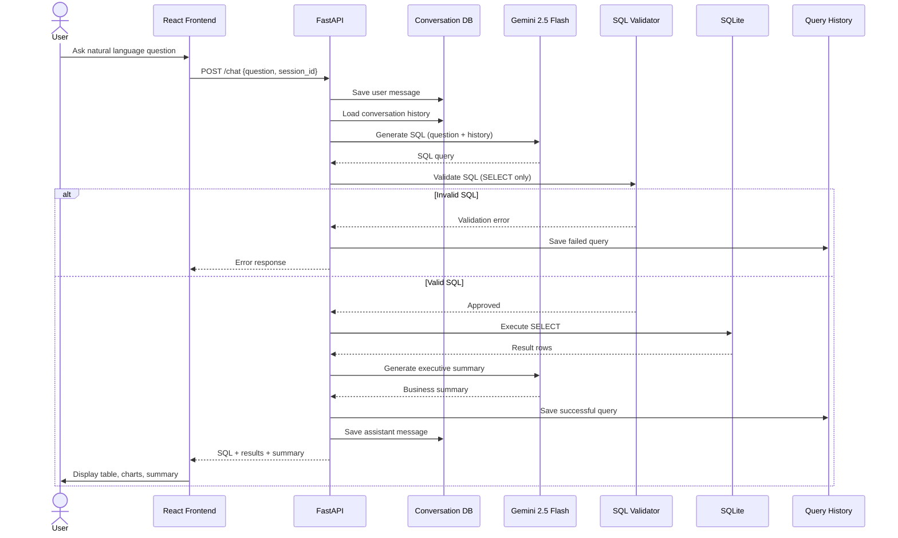
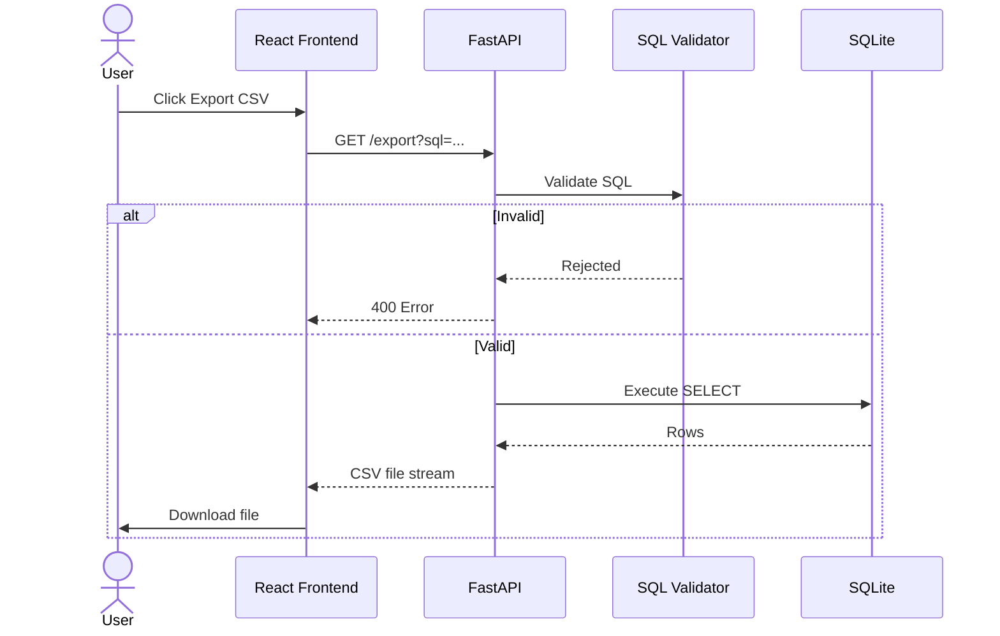
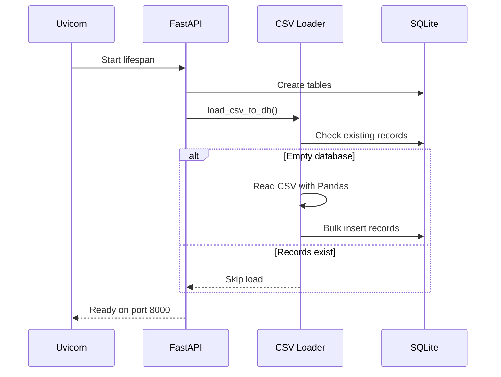
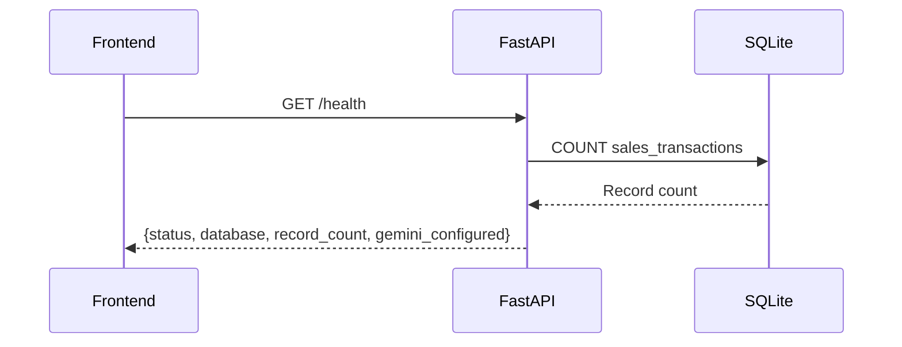

# Sequence Diagrams

## Chat Query Flow

```mermaid
sequenceDiagram
    actor User
    participant UI as React Frontend
    participant API as FastAPI
    participant Mem as Conversation DB
    participant LLM as Gemini 2.5 Flash
    participant Val as SQL Validator
    participant DB as SQLite
    participant Hist as Query History

    User->>UI: Ask natural language question
    UI->>API: POST /chat {question, session_id}
    API->>Mem: Save user message
    API->>Mem: Load conversation history
    API->>LLM: Generate SQL (question + history)
    LLM-->>API: SQL query
    API->>Val: Validate SQL (SELECT only)
    alt Invalid SQL
        Val-->>API: Validation error
        API->>Hist: Save failed query
        API-->>UI: Error response
    else Valid SQL
        Val-->>API: Approved
        API->>DB: Execute SELECT
        DB-->>API: Result rows
        API->>LLM: Generate executive summary
        LLM-->>API: Business summary
        API->>Hist: Save successful query
        API->>Mem: Save assistant message
        API-->>UI: SQL + results + summary
        UI->>User: Display table, charts, summary
    end
```

## CSV Export Flow

```mermaid
sequenceDiagram
    actor User
    participant UI as React Frontend
    participant API as FastAPI
    participant Val as SQL Validator
    participant DB as SQLite

    User->>UI: Click Export CSV
    UI->>API: GET /export?sql=...
    API->>Val: Validate SQL
    alt Invalid
        Val-->>API: Rejected
        API-->>UI: 400 Error
    else Valid
        API->>DB: Execute SELECT
        DB-->>API: Rows
        API-->>UI: CSV file stream
        UI->>User: Download file
    end
```

## Application Startup

```mermaid
sequenceDiagram
    participant Uvicorn
    participant App as FastAPI
    participant Loader as CSV Loader
    participant DB as SQLite

    Uvicorn->>App: Start lifespan
    App->>DB: Create tables
    App->>Loader: load_csv_to_db()
    Loader->>DB: Check existing records
    alt Empty database
        Loader->>Loader: Read CSV with Pandas
        Loader->>DB: Bulk insert records
    else Records exist
        Loader-->>App: Skip load
    end
    App-->>Uvicorn: Ready on port 8000
```

## Health Check

```mermaid
sequenceDiagram
    participant UI as Frontend
    participant API as FastAPI
    participant DB as SQLite

    UI->>API: GET /health
    API->>DB: COUNT sales_transactions
    DB-->>API: Record count
    API-->>UI: {status, database, record_count, gemini_configured}
```
